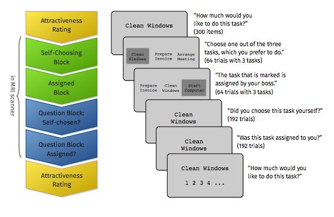

Introduction
============

The experiment is comprised of a pre-rating phase outside of the scanner, two
task phases inside the MRI scanner (as well as a resting state phase) and a post-rating
phase again outside of the scanner.

Phase 1 - Pre-Rating
--------------------
In the pre-rating phase all items loaded from the item list files are presented
to the participant in random order. For each item the participant is instructed
to rate the attractiveness of the particular item on a scale from 0-9 (how much
the participant would like to execute the activity presented). The phase starts
with screens giving instructions on how to do the rating.

The best rated third of the items will not be used in the later phases.

Phase 2 - Choice/Assignment
---------------------------
The choice/assignment phase is sub-divided into two parts that are each preceded
by screens giving instructions for the tasks. This phase is conducted in the scanner.

In the **choice phase** the participants are presented with three items from the
item lists. They are instructed to indicate which of the three tasks they are
choosing to do by pressing one of three buttons. The chosen item is marked by a
gray box after an item has been selected.

In the **assignment phase** three items are presented to the participant and after
some seconds delay one of the items is marked as being assigned to the participant
by a gray box like those that gave the feedback in the choice phase. The participant
is instructed to acknowledge the assignment by pressing the button corresponding
to the assigned item's position.

Phase 3 - Report
----------------
The report phase is sub-divided into two parts that are each preceded by screens
giving instructions for the tasks. This phase is conducted in the scanner.

In **choice report phase** the participant is presented with one item per screen that
has either been chosen by the participant or was neither chosen nor assigned. The
participant is instructed to indicate if the item was chosen or not.

In **assignment report phase** the participant is presented with one item per screen that
has either been assigned by the computer or was neither chosen nor assigned. The
participant is instructed to indicate if the item was assigned by the computer or not.

Phase 4 - Post-Rating
---------------------
The post-rating phase works exactly the same way as the pre-rating phase and is
conducted as the last phase of the experiment, again outside of the scanner.

Resting State Phase
-------------------
The resting state scan is being done between the choice/assignment phase and the
report phase. The participant is instructed to relax and not think of anything
special while watching a slide show of photos and listening to relaxing music.
